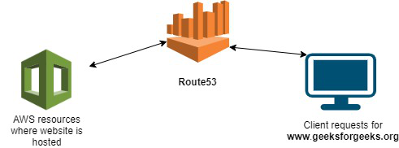
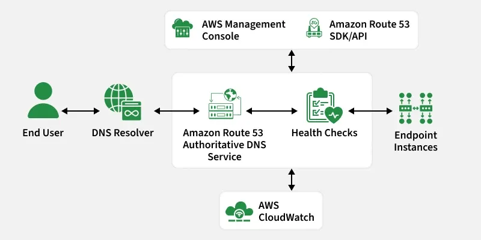

Amazon Route 53 is a highly available and scalable cloud Domain Name System (DNS) web service. In simplest terms, it acts as the phone book of the internet, translating human-readable domain names, such as www.google.com, into the numeric IP addresses (like 192.0.2.1) that computers use to connect to each other.

Beyond standard DNS, Route 53 is a powerful traffic management tool that can route users to the best endpoint based on latency, health, or geography.

Hosted Zone: A container for records that define how you want to route traffic for a specific domain (e.g., example.com) and its subdomains.

Public Hosted Zone: Routes internet traffic to your resources.
Private Hosted Zone: Routes internal traffic within an Amazon VPC.

Records (Resource Record Sets): The actual instructions in a hosted zone.

    A Record: Points a hostname to an IPv4 address.
    AAAA Record: Points a hostname to an IPv6 address.
    CNAME Record: Points a hostname to another hostname.
    Alias Record: An AWS-specific pointer that maps a hostname to an AWS resource (like an ELB or S3 bucket) for free and with better performance than CNAME.

Types of Routing Policies:
===========================

Route 53 offers sophisticated routing policies to control traffic flow:

1. Simple Routing:

Use Case: Single resource. "Route www.example.com to my one web server."
Behavior: Returns values in random order if multiple IPs are specified.

2. Weighted Routing:

Use Case: A/B Testing or Blue/Green deployments. "Send 90% of traffic to V1 and 10% to V2."
Behavior: Distributes traffic based on assigned weights.

3. Latency-Based Routing:

Use Case: Global applications. "Send users to the AWS Region that gives them the fastest response."
Behavior: Route 53 measures latency between the user and AWS regions and routes accordingly.

4. Failover Routing:

Use Case: Disaster Recovery (DR). "Send traffic to Primary. If Primary fails health checks, send to Secondary."
Behavior: Active-Passive failover.

5. Geolocation Routing:

Use Case: Compliance or localization. "Send users in France to French servers; users in the US to US servers."
Behavior: Routes based on the user's geographic location.

6. Geoproximity Routing:

Use Case: Traffic bias. "Route users based on physical distance to resources."
Behavior: More complex visualization, often used with Route 53 Traffic Flow.

7. Multivalue Answer Routing:

Use Case: Simple load balancing. "Give me up to 8 healthy IPs."
Behavior: Like Simple routing but with health checks.