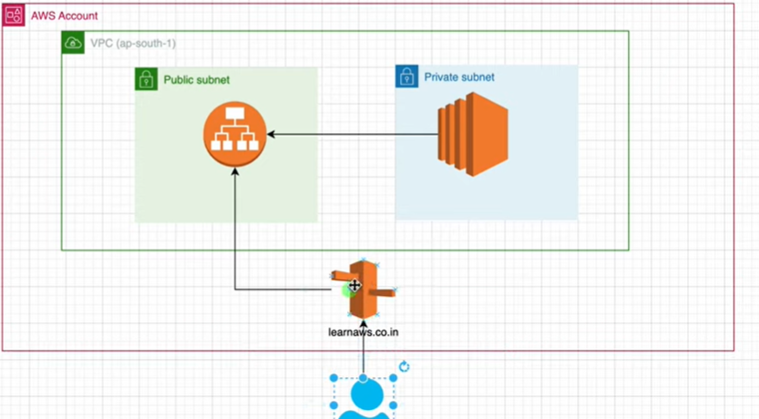

What is Route 53? 

“Route 53 is AWS DNS ( domain name system) service. It is used to map a domain name like myapp.com to AWS resources like Load Balancer, EC2, CloudFront, or S3. It also provides health checks and routing policies.”

