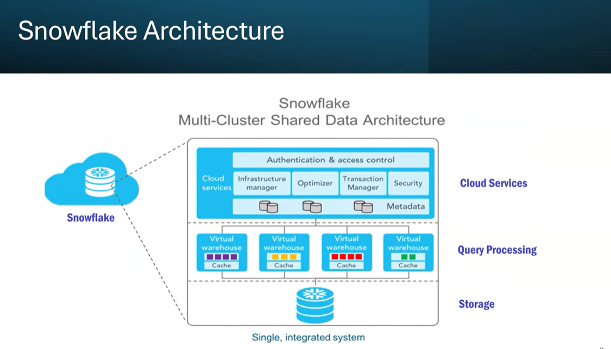
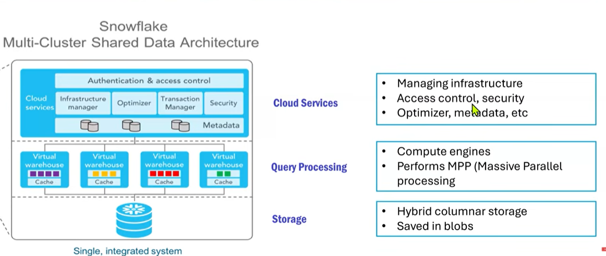
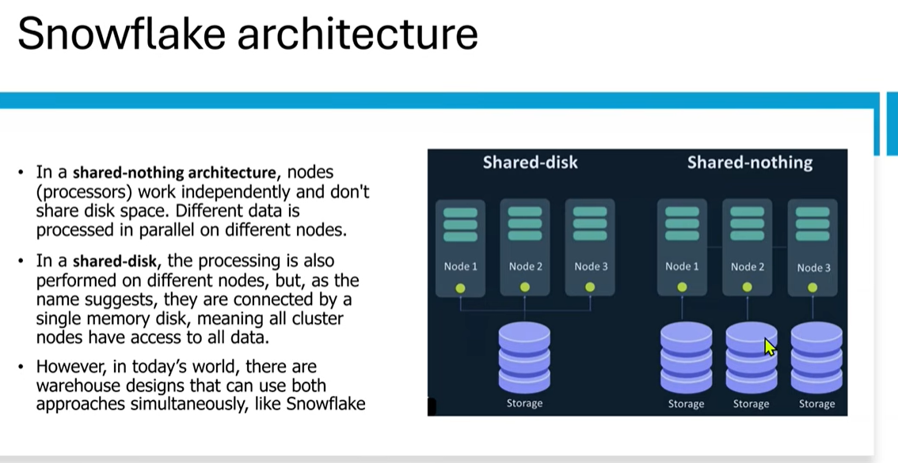
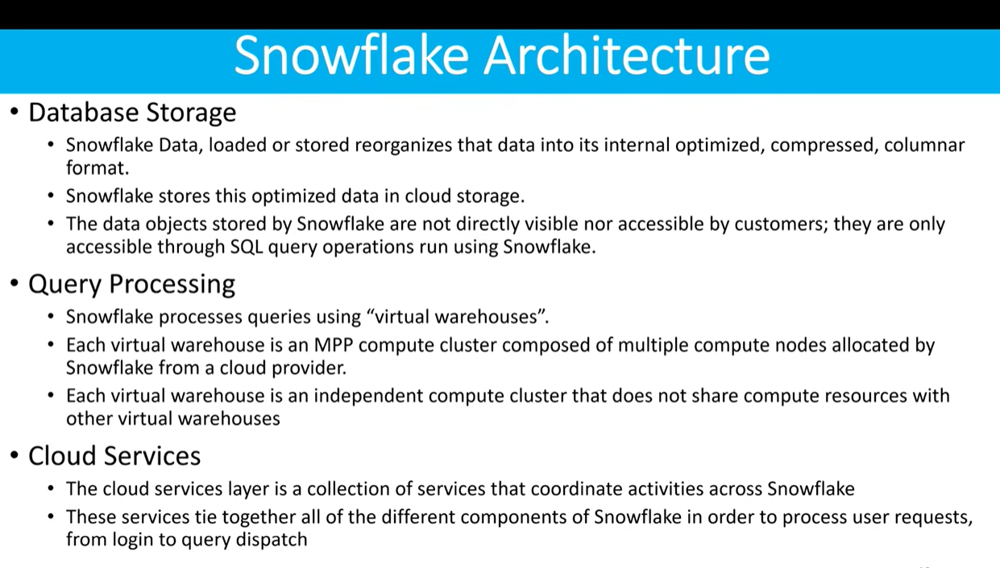
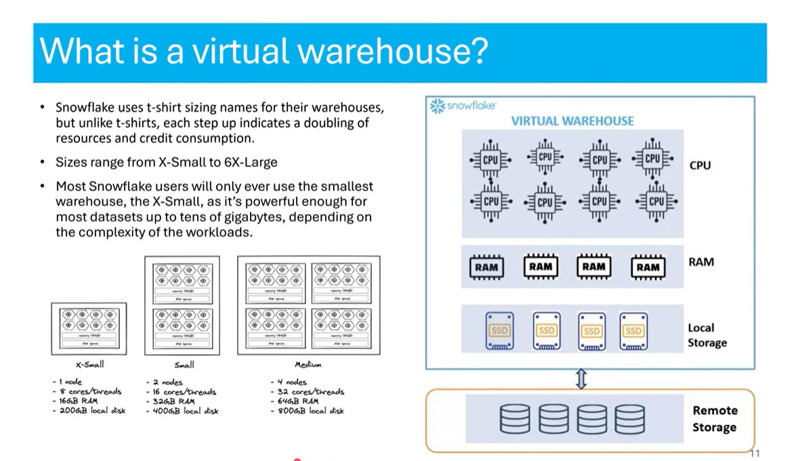

What is Snowflake
=================

    . Snowflake is an analytic cloud data warehouse that can store and analyze all your organizational data in one place provided as Software-as-a-Service (SaaS).
    . It can automatically scale up/down its compute resources to load, integrate, and analyze data.
    . Snowflake is built on top of Amazon Web Services, Microsoft Azure, and Google Cloud infrastructure.
    · There's no hardware or software to select, install, configure, or manage, so it's ideal for
        organizations that don't want to dedicate resources for setup, maintenance, and support of in-house servers.

Data Warehouse as a Cloud Service:
==================================

    . There is no hardware (virtual or physical) for you to select, install, configure, or manage.
    · There is no software for you to install, configure, or manage.
    . Ongoing maintenance, management, and tuning is handled by Snowflake
    · Snowflake runs completely on cloud infrastructure
    · Snowflake manages all aspects of software installation and updates.
    . SAAS - Software as a service
    . Snowflake cannot be run on private cloud infrastructures (on-premises or hosted)
    · Snowflake is not a packaged software offering that can be installed by a user. Snowflake manages
        all aspects of software installation and updates

SaaS, PaaS, and IaaS are cloud service models.:
============================================

IaaS means Infrastructure as a Service.

    In this model, the cloud provider gives us basic infrastructure like servers, storage, and networking. We are responsible for managing the operating system and application.
    Example: AWS EC2.

PaaS means Platform as a Service.

    Here, the cloud provider gives us a ready platform where we can directly deploy our application. We don’t need to manage servers or OS. We only focus on code and deployment.
    Example: AWS Elastic Beanstalk.

SaaS means Software as a Service.

    In this model, the cloud provider provides a complete software application which we can use directly through the internet. We just use it, and everything else is managed by the provider.
    Example: Gmail, Office 365.

So in short:
===============

    IaaS = we manage more things
    PaaS = we manage only application
    SaaS = we just use the software

1) Shared-Disk Architecture Meaning:

    Multiple compute nodes are there, but all nodes share the same storage (single disk / single memory storage).

Example in diagram:
===================

    Node 1, Node 2, Node 3
    ➡️ all are connected to one common storage.

2) Shared-Nothing Architecture Meaning:

    Each node has its own storage and works independently.

Example in diagram:
==================

    Node 1 has its own storage
    Node 2 has its own storage
    Node 3 has its own storage

Advantage:
==========

    Very good for scalability and performance because no one is sharing same disk.

🔥 Interview Spoken Answer (Best)

    "Snowflake follows a multi-cluster shared data architecture. It separates compute and storage. Storage is centralized and shared, but compute clusters are independent, so multiple warehouses can query the same data without impacting each other. This gives high scalability, performance, and concurrency."

✅ What is a Virtual Warehouse in Snowflake?

    A Virtual Warehouse in Snowflake is basically a compute cluster.

    It provides the CPU, RAM, and temporary local storage needed to run:

    SQL queries
    Data loading (COPY)
    Transformations (ETL/ELT)

👉 It is not a storage place, it is only for processing.

✅ Why Virtual Warehouse is useful?

    Because:

    We can create multiple warehouses
    Different teams can run queries without affecting each other
    We can scale up or down anytime
    We can pause it to save cost

🎯 Interview Answer (Best Spoken)

    "A virtual warehouse in Snowflake is a compute resource that provides CPU, memory, and temporary storage to execute queries and load data. It is independent of storage, so multiple warehouses can access the same data without impacting each other. We can scale it up or down based on workload and also auto-suspend to reduce cost."